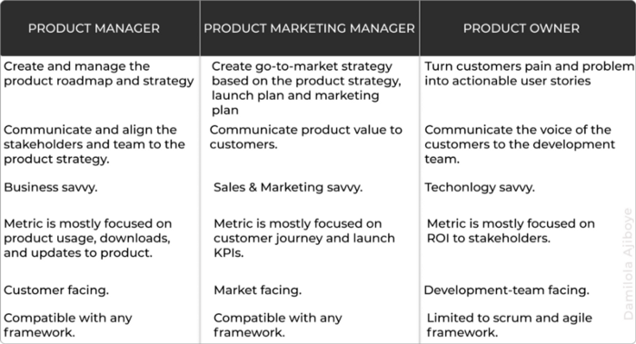

This is a question that often arises in the product world and it requires our time to unpack it. Though these roles are somewhat similar and they work towards achieving the same set of goals, we then ought to look at the clear line distinction in the line of duty of the individuals and performance metric used to evaluate the success achieved by each role to help us understand them better and also help you figure out the most suitable for you.

These roles vary from company to company as in the case of a startup, a product manager is often tasked with the duty of these 3 roles while in larger or enterprise companies, there are 3 or more different roles in the product team working at different capacities to ensure that the right product is shipped and meet the demands of users.

While the product manager’s role is one that has come to limelight, the product marketing manager and product owner role have also been adopted by a lot of companies depending on their product and company culture. In this article, we will explain the difference between these roles and the job requirement of the individual involved.

 ### The Product Manager
These individuals are often referred to as mini CEOs of a product. They conduct customer surveys to figure out the customer’s pain and build solutions to address it. The PM also prioritizes what features are to be built next and prepares and manages a cohesive and digital product roadmap and strategy.

### The Product Marketing Manager
The PMM communicates vital product value — the “why”, “what” and “when” of a product to intending buyers. He manages the go-to-market strategy/roadmap and also oversees the pricing model of the product. The primary goal of a PMM is to create demand for the products through effective messaging and marketing programs so that the product has a shorter sales cycle and higher revenue.

### The Product Owner
This role exists in a scrum environment — _[Scrum](https://www.scrum.org/resources/what-is-scrum "Scrum") is a framework for project management that emphasizes teamwork, accountability, and iterative progress toward a well-defined goal._

A product owner (PO) maximizes the value of a product through the creation and management of the product backlog, creation of user stories for the development team. The product owner is the customer’s representative to the development team. He addresses customer’s pain points by managing and prioritizing a visible product backlog. The PO is the first point of call when the development team needs clarity about interpreting a product feature to be implemented.

  

Going more practical, we will use a hypothetical case study of a tech company, Slyde, to explain these roles to clearly understand their day-to-day duties.

Slyde is a financial technology company based in Lagos, Nigeria with coverage in other African countries. The company has been providing payment solutions through its web-based application but has noticed a large churn rate in areas with poor internet connection which in turn delay users from completing their transaction. The product team made this observation and has been tasked to come up with a solution.

### Where does the Product Manager, Product Marketing Manager, and the Product Owner come in?

**PM**: The Product Manager will interface with the users through user interviews/feedback surveys or other means to hear directly from the users. They will come up with hypotheses alongside the team and validate them through prototyping and user testing. They will then create a strategy on the feature and align the team and stakeholders around it. The PM who is also the chief custodian of the entire product roadmap will, therefore, be tasked with the duty of prioritization. Before going ahead to carry out research and strategy, they will have to convince the stakeholders if it is a good choice to build the feature in context at that particular time or wait a bit longer based on the content of the roadmap.

**PMM**: The product marketing manager is tasked with market feasibility and discovering if the features being built align with the company’s sales and revenue plan for the period. They also make research on how sought-after the feature is being anticipated and how it will impact the budget. They communicate the values of the feature; the why, what, and when to potential buyers — In this case users in countries with poor internet connection.

**PO**: The product owner will first have to prioritize the backlog to see if there are no important tasks to be executed and if this new feature is worth leaving whatever is being built currently. They will also consider the development effort required to build the feature i.e the time, tools, and skill set that will be required. They will be the one to tell if the expertise of the current developers is enough or if more engineers or designers are needed to be able to deliver at the scheduled time. The product owner is also armed with the task of interpreting the product/feature requirements for the development team. They serve as the interface between the stakeholders and the development team.

---

Lastly,

The goal of a product team is to delight its user by providing an excellent solution to their pain points regardless of the job title/role. Irrespective of your job role on a product team, you should always be driven by user empathy and the company’s goal as this will in-turn make you collaborate better among the team. A product person should first and foremost see themselves as a product leader — one who makes sure the user’s need is always advocated for, despite top executive declination, the product person is to persuasively align the executive to this.

 >> Product Owner is a role you play on a Scrum team. Product Manager is the job. — Melissa Perri

So, regardless of your job role, a great product person will always act in the stead of a product manager and never streamline herself to the JD only but be actively involved directly or indirectly in every phase of the product development cycle. When the role is clearly understood and the duties implemented collaboratively as a team, every aspect of the product comes together in one beautiful piece.

This article first appeared on my [Medium](https://blog.usejournal.com/product-manager-vs-product-marketing-manager-vs-product-owner-8ab08bc45662 "Medium")
